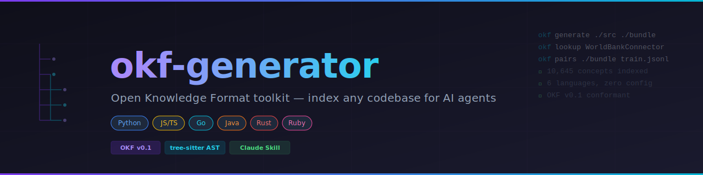

<div align="center">



<br/>

[](https://pypi.org/project/okf-generator/)
[](https://pypi.org/project/okf-generator/)
[](https://github.com/umairbaig/okf-generator/actions)
[](LICENSE)
[](https://cloud.google.com/blog/products/data-analytics/how-the-open-knowledge-format-can-improve-data-sharing)
[](SKILL.md)
[](CONTRIBUTING.md)

**Index any codebase into a structured OKF v0.1 knowledge bundle — then look up exact concepts for AI agents like OpenCode.**

[Installation](#installation) · [Quick Start](#quick-start) · [CLI Reference](#cli-reference) · [OpenCode Integration](#opencode-integration) · [Contributing](#contributing)

</div>

---

## What is this?

`okf-generator` converts your source code into an [Open Knowledge Format](https://cloud.google.com/blog/products/data-analytics/how-the-open-knowledge-format-can-improve-data-sharing) (OKF) v0.1 knowledge bundle — structured markdown files that AI agents can read, search, and reason over.

Instead of giving an AI your entire codebase, you give it exactly the concept it needs:

```bash
# Before touching WorldBankConnector, look it up
okf lookup WorldBankConnector

# CLASS: WorldBankConnector
# Source      : StockAI/RnD/python/connectors/economic_data.py  line 51
# Description : Fetches World Bank development indicators via wbdata API.
# Methods     : get_indicator, search
# Signature   : class WorldBankConnector
```

## Features

- **6 languages** — Python (stdlib AST), JS/TS/Go/Java/Rust/Ruby (tree-sitter)
- **Zero LLM required** for extraction — deterministic, fast, offline-capable
- **OKF v0.1 conformant** — type, description, resource, tags, timestamp
- **Domain/resource-path layout** — bundle mirrors your source tree exactly
- **Resumable LLM enrichment** — enrich descriptions with any OpenAI-compat endpoint; safe to interrupt and rerun
- **OpenCode integration** — `AGENTS.md` + custom commands for pinpoint context injection
- **Training data pipeline** — convert bundle to JSONL pairs (codegen, QA, doc, summarize, crosslink)
- **Claude Skill** — install `SKILL.md` to trigger the full pipeline from natural language

## Installation

```bash
# Core (extraction only — no LLM required)
pip install okf-generator

# With LLM enrichment + training pair generation
pip install okf-generator[llm]
```

**Requirements:** Python 3.11+

## Quick Start

```bash
# 1. Generate a knowledge bundle from your codebase
okf generate ./my_project ./okf_bundle

# 2. Look up a concept (works instantly, zero LLM)
okf lookup WorldBankConnector

# 3. Find all concepts from one file
okf lookup --file src/connectors/economic_data.py

# 4. Generate training pairs from the bundle
okf pairs ./okf_bundle ./train.jsonl

# 5. Regenerate SUMMARY.md after enrichment
okf summarize ./okf_bundle
```

## Bundle Layout

The output mirrors your source tree — not flat buckets:

```
okf_bundle/
├── SUMMARY.md                        ← bird's-eye view for AI agents
├── index.md                          ← root navigation
├── log.md                            ← generation history
└── StockAI/
    └── RnD/
        └── python/
            └── connectors/
                ├── index.md          ← lists all concepts in this folder
                ├── economic_data.md  ← Module concept
                └── economic_data/
                    ├── WorldBankConnector.md   ← Class
                    ├── get_indicator.md        ← Function
                    └── search.md               ← Function
```

Each file is OKF v0.1 conformant:

```yaml
---
type: Class
title: WorldBankConnector
description: Fetches World Bank development indicators via wbdata API.
resource: StockAI/RnD/python/connectors/economic_data.py
tags:
  - lang:python
  - type:Class
  - module:StockAI
  - domain:RnD
  - git:branch:main
  - git:repo:TrainLLMs
timestamp: '2026-05-23T09:01:21Z'
---

# WorldBankConnector

...signature, docstring, params, returns, methods, related concepts...
```

## CLI Reference

### `okf generate`

```
okf generate <source_dir> [output_dir]

Options:
  --summarize <bundle_dir>   Regenerate SUMMARY.md only (no re-scan)

Environment variables (LLM enrichment):
  OKF_ENRICH=1               Enable LLM enrichment
  OKF_BASE_URL               OpenAI-compat base URL (default: https://api.anthropic.com/v1)
  OKF_API_KEY                API key
  OKF_MODEL                  Model name (default: claude-sonnet-4-6)
  OKF_MAX_WORKERS            Parallel workers (default: 2)
```

### `okf lookup`

```
okf lookup [query] [options]

Options:
  --bundle PATH     Bundle directory (default: ./okf_bundle)
  --file PATH       Filter by source file
  --type TYPE       Filter by concept type: Function | Class | Module
  --tag TAG         Filter by tag, repeatable: --tag lang:python
  --limit N         Max results (default: 10)
  --compact         One-line output per result
  --json            JSON output for programmatic use
  --full            Raw .md file content
  --min-score N     Minimum relevance score 0-1 (default: 0.1)
```

### `okf pairs`

```
okf pairs <bundle_dir> [output_file]

Environment variables:
  SKIP_SYNTH=1          Static pairs only (no LLM)
  SYNTH_BASE_URL        API endpoint
  SYNTH_API_KEY         API key
  SYNTH_MODEL           Model name
  MAX_WORKERS           Parallel workers (default: 3)
  QA_PER_CONCEPT        Q&A pairs per concept (default: 3)
  PAIR_TYPES            Comma-separated: codegen,qa,doc,summarize,crosslink
```

## Supported Languages

| Language | Parser | Extracts |
|----------|--------|---------|
| Python | stdlib `ast` | Functions, classes, params, return types, docstrings |
| JavaScript / TypeScript | tree-sitter | Functions, arrow fns, classes, JSDoc |
| Go | tree-sitter | Funcs, methods, structs, interfaces, GoDoc |
| Java | tree-sitter | Classes, methods, constructors, Javadoc |
| Rust | tree-sitter | Fns, structs, enums, traits, impl blocks, `///` |
| Ruby | tree-sitter | Defs, classes, modules, `#` comments |

## LLM Enrichment

Works with any OpenAI-compatible endpoint — Claude, Ollama, llama.cpp, etc:

```bash
# Using a local llama.cpp server
OKF_ENRICH=1 \
OKF_BASE_URL="http://localhost:8080/v1" \
OKF_API_KEY="llamabarn" \
OKF_MODEL="ggml-org/gemma-3-4b-it-qat-GGUF:Q4_0" \
OKF_MAX_WORKERS=2 \
okf generate ./my_project ./okf_bundle
```

Enrichment is **resumable** — interrupt and rerun freely. Already-enriched concepts are skipped.

## OpenCode Integration

```bash
# 1. Tell OpenCode about the bundle (auto-loaded every session)
cat >> AGENTS.md << 'EOF'
## OKF Knowledge Bundle
Before working on any class or function, look it up:
  okf lookup --bundle ./okf_bundle <ConceptName>
EOF

# 2. Add a custom command
mkdir -p .opencode/commands
echo "RUN okf lookup --bundle ./okf_bundle \$NAME" > .opencode/commands/lookup.md
```

Then in OpenCode: `/lookup NAME=WorldBankConnector`

See [docs/opencode-integration.md](references/opencode-integration.md) for full setup.

## Python API

```python
from okf.generator import scan_codebase, write_bundle, write_summary
from okf.lookup import load_bundle, search

# Generate bundle
concepts = scan_codebase("./my_project")
write_bundle(concepts, "./okf_bundle", "my_project", ["initial generation"])
write_summary("my_project", concepts, "./okf_bundle", {})

# Search concepts
bundle = load_bundle("./okf_bundle")
results = search(bundle, tokens=["WorldBankConnector"])
print(results[0]["description"])
```

## Training Data

Convert your OKF bundle into JSONL training pairs for fine-tuning:

```bash
# 5 pair types: codegen, qa, doc, summarize, crosslink
okf pairs ./okf_bundle ./train.jsonl
```

Each pair is in chat format compatible with most fine-tuning pipelines.

## Claude Skill

Install `SKILL.md` to trigger the full pipeline from natural language inside Claude:

> *"Index my codebase"* → generates OKF bundle  
> *"Look up WorldBankConnector"* → returns exact concept  
> *"Generate training pairs from my bundle"* → outputs JSONL  

## Contributing

Contributions are welcome! See [CONTRIBUTING.md](CONTRIBUTING.md) for guidelines.

```bash
git clone https://github.com/umairbaig/okf-generator
cd okf-generator
pip install -e ".[dev]"
pytest tests/
```

**Good first issues:** adding a new language parser, improving fuzzy search scoring, adding a CHANGELOG.

## License

[MIT](LICENSE) — Copyright © 2026 Umair Baig
